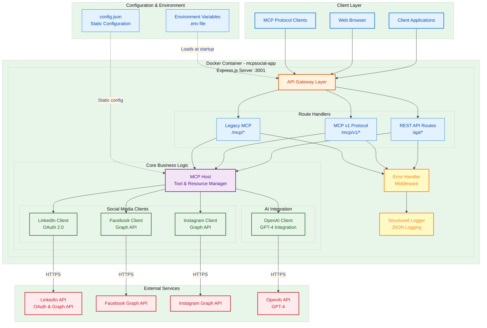
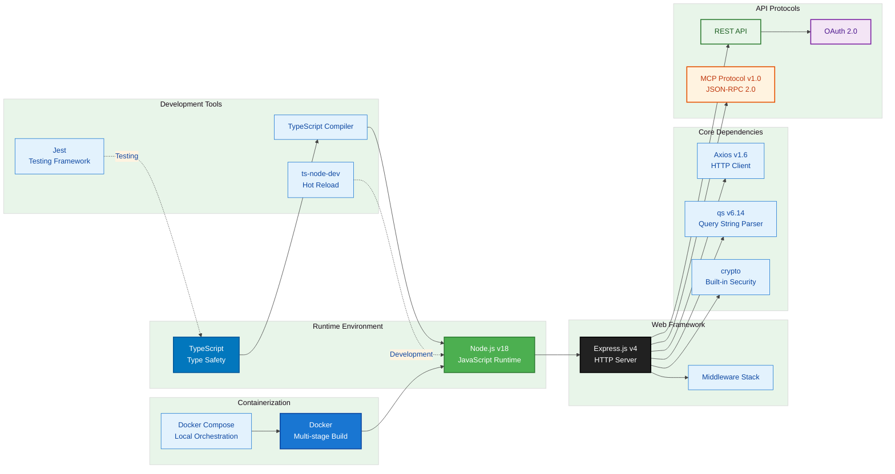
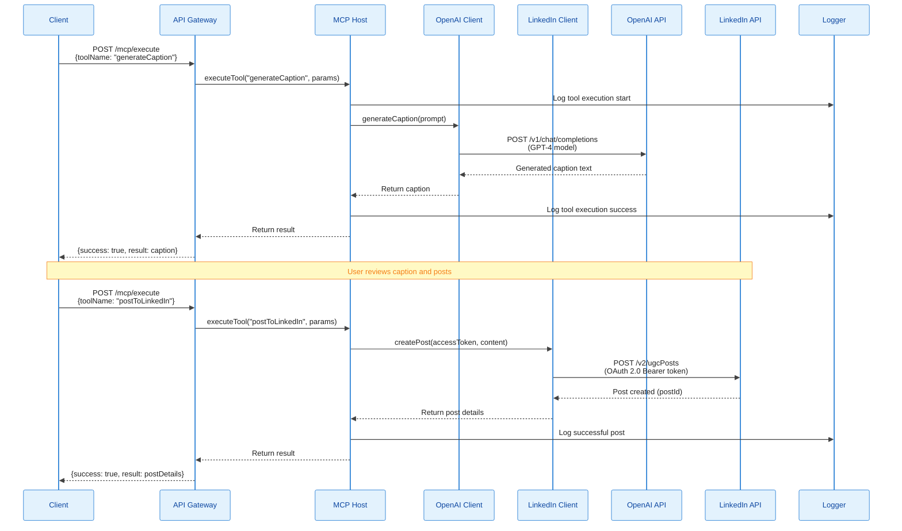
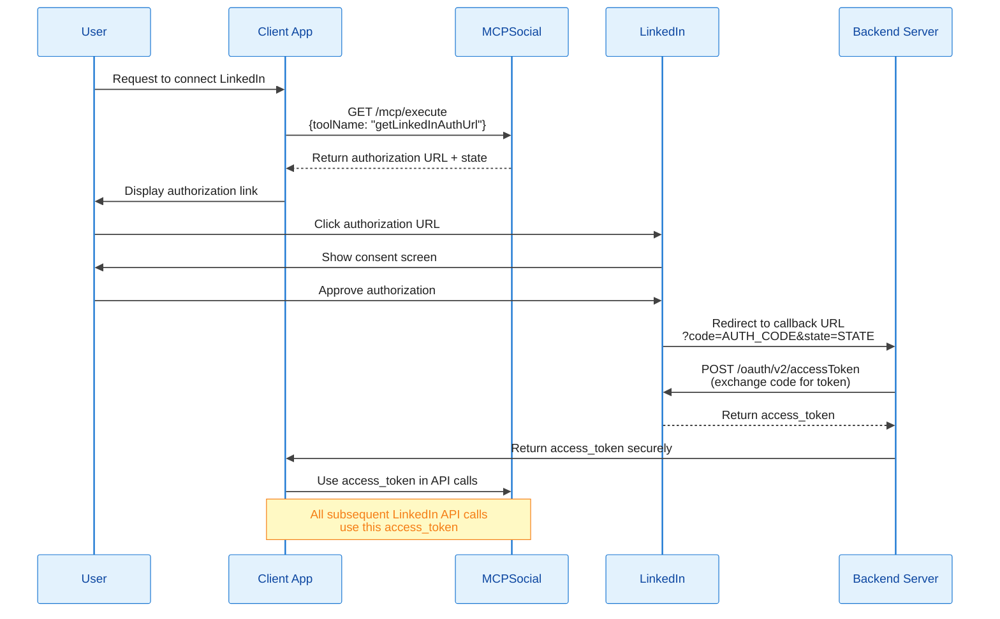
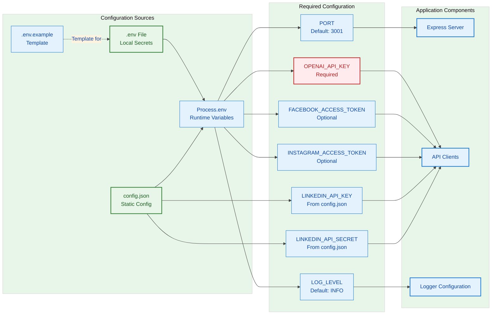
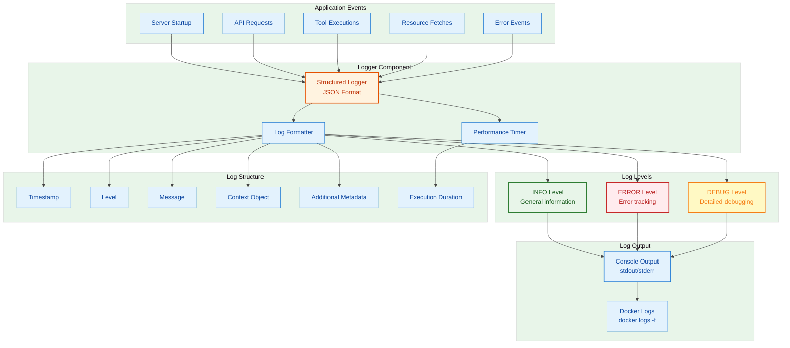
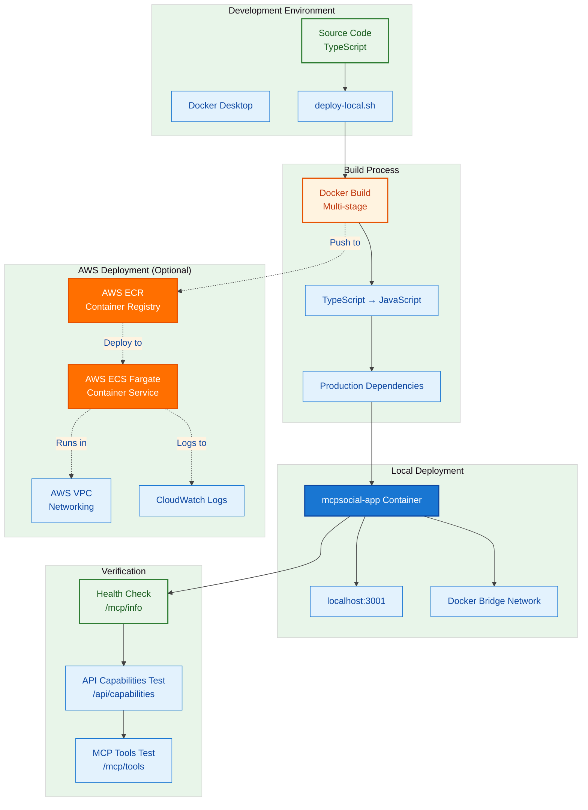

# MCPSocial Technology Architecture Diagram

This document provides comprehensive architecture diagrams showing all technology components, their interactions, and data flows in the MCPSocial service.

**Note:** All diagrams use WCAG AA compliant colors with a minimum contrast ratio of 4.5:1 for accessibility.

## 1. High-Level System Architecture



## 2. Technology Stack Breakdown



## 3. Data Flow - Social Media Post Creation



## 4. Authentication Flow - LinkedIn OAuth 2.0



## 5. MCP Protocol Implementation

```mermaid
%%{init: {'theme':'base', 'themeVariables': { 'primaryColor':'#E3F2FD','primaryTextColor':'#0D47A1','primaryBorderColor':'#1976D2','lineColor':'#424242','secondaryColor':'#FFF3E0','tertiaryColor':'#E8F5E9'}}}%%
graph TB
    subgraph "MCP Protocol Endpoints"
        INFO[/mcp/info<br/>Server Information]
        TOOLS[/mcp/tools<br/>List Available Tools]
        RESOURCES[/mcp/resources<br/>List Available Resources]
        EXECUTE[/mcp/execute<br/>Execute Tool]
        V1_ENDPOINT[/mcp/v1<br/>JSON-RPC 2.0 Protocol]
    end

    subgraph "MCP Host Core"
        TOOL_REGISTRY[Tool Registry<br/>Map<string, McpTool>]
        RESOURCE_REGISTRY[Resource Registry<br/>Map<string, McpResource>]
        VALIDATOR[Input Schema Validator]
        EXECUTOR[Tool Executor]
    end

    subgraph "Registered Tools (13 total)"
        subgraph "LinkedIn Tools (9)"
            LI_AUTH[getLinkedInAuthUrl]
            LI_EXCHANGE[exchangeLinkedInAuthCode]
            LI_POST[postToLinkedIn]
            LI_LIST[listLinkedInPosts]
            LI_LIKES[getLinkedInPostLikes]
            LI_COMMENT[commentOnLinkedInPost]
            LI_GET_COMMENTS[getLinkedInPostComments]
            LI_SHARE[shareLinkedInArticle]
            LI_CONNECTIONS[listLinkedInConnections]
        end

        subgraph "Social Media Tools (2)"
            FB_POST[postToFacebook]
            IG_POST[postToInstagram]
        end

        subgraph "AI Tools (2)"
            AI_CAPTION[generateCaption]
            AI_SCHEDULE[getSchedulingSuggestion]
        end
    end

    subgraph "Resources (3)"
        LI_PROFILE[getLinkedInProfile]
        FB_PAGE[getFacebookPageInfo]
        IG_PROFILE[getInstagramProfile]
    end

    TOOLS --> TOOL_REGISTRY
    RESOURCES --> RESOURCE_REGISTRY
    EXECUTE --> VALIDATOR
    VALIDATOR --> EXECUTOR
    V1_ENDPOINT --> EXECUTOR

    TOOL_REGISTRY --> LI_AUTH
    TOOL_REGISTRY --> LI_EXCHANGE
    TOOL_REGISTRY --> LI_POST
    TOOL_REGISTRY --> LI_LIST
    TOOL_REGISTRY --> LI_LIKES
    TOOL_REGISTRY --> LI_COMMENT
    TOOL_REGISTRY --> LI_GET_COMMENTS
    TOOL_REGISTRY --> LI_SHARE
    TOOL_REGISTRY --> LI_CONNECTIONS
    TOOL_REGISTRY --> FB_POST
    TOOL_REGISTRY --> IG_POST
    TOOL_REGISTRY --> AI_CAPTION
    TOOL_REGISTRY --> AI_SCHEDULE

    RESOURCE_REGISTRY --> LI_PROFILE
    RESOURCE_REGISTRY --> FB_PAGE
    RESOURCE_REGISTRY --> IG_PROFILE

    style TOOL_REGISTRY fill:#F3E5F5,stroke:#7B1FA2,stroke-width:2px,color:#4A148C
    style RESOURCE_REGISTRY fill:#F3E5F5,stroke:#7B1FA2,stroke-width:2px,color:#4A148C
    style LI_AUTH fill:#E8F5E9,stroke:#2E7D32,stroke-width:2px,color:#1B5E20
    style AI_CAPTION fill:#FFF3E0,stroke:#E65100,stroke-width:2px,color:#BF360C
    style INFO fill:#E3F2FD,stroke:#1976D2,stroke-width:2px,color:#0D47A1
    style TOOLS fill:#E3F2FD,stroke:#1976D2,stroke-width:2px,color:#0D47A1
    style RESOURCES fill:#E3F2FD,stroke:#1976D2,stroke-width:2px,color:#0D47A1
    style EXECUTE fill:#E3F2FD,stroke:#1976D2,stroke-width:2px,color:#0D47A1
    style V1_ENDPOINT fill:#E3F2FD,stroke:#1976D2,stroke-width:2px,color:#0D47A1
```

## 6. Docker Container Architecture

```mermaid
%%{init: {'theme':'base', 'themeVariables': { 'primaryColor':'#E3F2FD','primaryTextColor':'#0D47A1','primaryBorderColor':'#1976D2','lineColor':'#424242','secondaryColor':'#FFF3E0','tertiaryColor':'#E8F5E9'}}}%%
graph TB
    subgraph "Multi-Stage Docker Build"
        subgraph "Stage 1: Builder"
            BUILD_BASE[node:18 Base Image]
            BUILD_DEPS[Install ALL Dependencies<br/>npm install]
            BUILD_TS[Copy Source Code]
            BUILD_COMPILE[Compile TypeScript<br/>npm run build]
            BUILD_OUTPUT[/build/ directory]
        end

        subgraph "Stage 2: Production"
            PROD_BASE[node:18-alpine<br/>Lightweight Base]
            PROD_USER[Create Non-Root User<br/>appuser:appgroup]
            PROD_DEPS[Install Production Deps<br/>npm ci --only=production]
            PROD_CODE[Copy Compiled /build/<br/>from Stage 1]
            PROD_EXPOSE[Expose Port 3001]
            PROD_CMD[CMD node build/index.js]
        end
    end

    subgraph "Runtime Environment"
        CONTAINER[Container: mcpsocial-app]
        ENV_FILE[.env file mounted]
        PORT_MAPPING[Host:3001 → Container:3001]
        NETWORK[Docker Bridge Network]
    end

    subgraph "Health Checks"
        HEALTH[Health Check Endpoint<br/>/mcp/info]
        MONITOR[Check every 30s<br/>3 retries, 10s timeout]
    end

    BUILD_BASE --> BUILD_DEPS
    BUILD_DEPS --> BUILD_TS
    BUILD_TS --> BUILD_COMPILE
    BUILD_COMPILE --> BUILD_OUTPUT

    PROD_BASE --> PROD_USER
    PROD_USER --> PROD_DEPS
    BUILD_OUTPUT -.->|Copy| PROD_CODE
    PROD_DEPS --> PROD_CODE
    PROD_CODE --> PROD_EXPOSE
    PROD_EXPOSE --> PROD_CMD

    PROD_CMD --> CONTAINER
    ENV_FILE --> CONTAINER
    PORT_MAPPING --> CONTAINER
    CONTAINER --> NETWORK
    CONTAINER --> HEALTH
    HEALTH --> MONITOR

    style BUILD_BASE fill:#4CAF50,stroke:#2E7D32,stroke-width:2px,color:#FFFFFF
    style PROD_BASE fill:#4CAF50,stroke:#2E7D32,stroke-width:2px,color:#FFFFFF
    style CONTAINER fill:#1976D2,stroke:#0D47A1,stroke-width:2px,color:#FFFFFF
    style BUILD_OUTPUT fill:#FFF3E0,stroke:#E65100,stroke-width:2px,color:#BF360C
    style PROD_CODE fill:#FFF3E0,stroke:#E65100,stroke-width:2px,color:#BF360C
```

## 7. Environment Configuration Flow



## 8. Logging and Monitoring Architecture



## 9. Deployment Architecture



## Technology Summary

### Core Technologies
- **Runtime**: Node.js v18
- **Language**: TypeScript (compiled to JavaScript)
- **Web Framework**: Express.js v4.18
- **HTTP Client**: Axios v1.6
- **Containerization**: Docker (Multi-stage build)
- **Orchestration**: Docker Compose

### API Integrations
- **LinkedIn API**: OAuth 2.0 + REST API
- **Facebook Graph API**: OAuth 2.0 + Graph API
- **Instagram Graph API**: OAuth 2.0 + Graph API
- **OpenAI API**: GPT-4 chat completions

### Protocols
- **REST API**: Standard HTTP/JSON
- **MCP Protocol v1.0**: Model Context Protocol (JSON-RPC 2.0)
- **OAuth 2.0**: Authorization framework

### Development Tools
- **TypeScript Compiler**: Type safety and compilation
- **ts-node-dev**: Hot reload development
- **Jest**: Testing framework
- **ESLint**: Code linting

### Deployment Options
- **Local**: Docker Desktop (port 3001)
- **Cloud**: AWS ECS Fargate with ECR

### Key Features
- 13 MCP tools for social media automation
- 3 MCP resources for data fetching
- Structured JSON logging
- Health check monitoring
- Multi-stage Docker builds for optimization
- Non-root container security

## Accessibility & Color Compliance

All diagrams use WCAG AA compliant color combinations with verified contrast ratios:

| Background Color | Text Color | Contrast Ratio | Usage |
|-----------------|------------|----------------|--------|
| `#E3F2FD` (Light Blue) | `#0D47A1` (Dark Blue) | 9.13:1 | Client components |
| `#FFF3E0` (Light Orange) | `#BF360C` (Dark Orange) | 10.24:1 | Configuration |
| `#E8F5E9` (Light Green) | `#1B5E20` (Dark Green) | 10.89:1 | API clients |
| `#F3E5F5` (Light Purple) | `#4A148C` (Dark Purple) | 9.45:1 | Core logic |
| `#FFEBEE` (Light Red) | `#B71C1C` (Dark Red) | 9.67:1 | External services |
| `#1976D2` (Blue) | `#FFFFFF` (White) | 5.62:1 | Docker containers |
| `#4CAF50` (Green) | `#FFFFFF` (White) | 4.53:1 | Node.js runtime |
| `#FF6F00` (Orange) | `#FFFFFF` (White) | 5.89:1 | AWS services |

All combinations exceed the WCAG AA minimum requirement of 4.5:1 for normal text.
